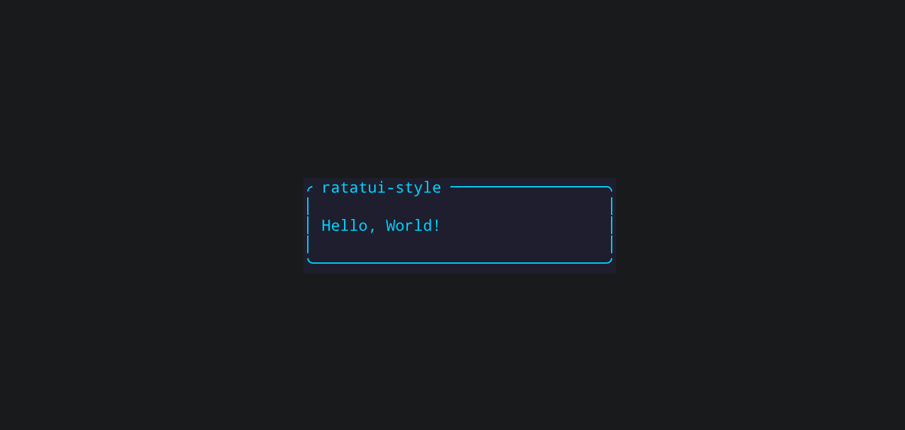

# ratatui-style

[](https://crates.io/crates/ratatui-style)
[](https://docs.rs/ratatui-style)
[](LICENSE)

**[中文](README.md)**

A CSS cascade engine for [ratatui](https://ratatui.rs) — selectors, specificity,
inheritance, pseudo-states, and data-driven styling. It produces **native
ratatui `Style` / `Block` / `Constraint` values**; it is never a parallel
rendering stack.

It speaks standard CSS property names (`color`, `background-color`, `font-weight`,
`border`, `padding`, `margin`, `text-align`, `width`, …), is `serde`-friendly
(so server-driven UIs can ship style over the wire as JSON), and implements the
cascade rule: **origin × specificity × inheritance × pseudo-states**.

## Screenshots

<p align="center">
  <a href="examples/00_hello_world.rs"><b>00_hello_world</b> · minimal first render</a><br>
  
</p>

<p align="center">
  <a href="examples/06_tailwind.rs"><b>06_tailwind</b> · utility-class design system</a><br>
  
</p>

<p align="center">
  <a href="examples/07_scifi_hud.rs"><b>07_scifi_hud</b> · cyberpunk HUD</a><br>
  
</p>

See [Examples](#examples) below for the full list.

## Quick start

```rust
use ratatui_style::{CssStyle, Origin, OwnedNode, Stylesheet};

let mut sheet = Stylesheet::new();
sheet.add(
    "Button.primary",
    CssStyle::new().color("#fff").background("blue").bold(),
    Origin::User,
)?;

let node = OwnedNode::new("Button").with_classes(["primary"]);
let computed = sheet.compute(&node, None);

// Project onto native ratatui:
let _style   = computed.to_style();         // → ratatui::style::Style
let _block   = computed.to_block();         // → ratatui::widgets::Block
let _area    = computed.apply_margin(area); // shrinks a Rect
let _layout  = computed.constraints();      // → (Constraint, Constraint)
let _align   = computed.alignment();        // → Alignment
```

### Typed input for the box-model builder

`.padding()` / `.margin()` / `.border()` accept either typed values (zero panics) or keep the convenience of CSS shorthand strings:

```rust
use ratatui_style::{BorderStyle, CssStyle};

// Typed — never panics
CssStyle::new().padding(1u16);                       // all four sides = 1
CssStyle::new().padding((0u16, 2u16));               // top/bottom 0, left/right 2
CssStyle::new().padding((1u16, 2u16, 3u16, 4u16));   // top right bottom left
CssStyle::new().border(BorderStyle::Rounded);
CssStyle::new().border((BorderStyle::Rounded, "#00d4ff"));

// String shorthand still works (good for compile-time-known literals; bad values panic)
CssStyle::new().padding("0 2").border("rounded #00d4ff");
```

## CSS text stylesheets

```rust
use ratatui_style::Stylesheet;

let sheet = Stylesheet::parse(r#"
    :root { --accent: #00d4ff; }

    Button.primary {
        color: var(--accent);
        background: blue;
        font-weight: bold;
        border: rounded;
        padding: 0 2;
    }
    Button:focus { background: green; }
    #save:disabled { color: gray; }
"#)?;
```

## Cascade model

The cascade resolves styles per element in five steps:

1. **Collect** all rules whose selector matches the node.
2. **Sort** ascending by `(origin, specificity, source_order)`.
3. **Overlay** declarations — later rules replace earlier ones field-by-field.
4. **Inherit** — inheritable properties (`color`, `font-weight`, `font-style`,
   `text-decoration`, `underline-color`, `text-align`) flow from the parent's
   computed style into `None` fields on the child.
5. **Resolve** `var()` references against the token table.

### Origin layers

Rules are layered by origin; higher origins override lower ones at equal
specificity:

| Origin | Priority | Use for |
|---|---|---|
| `UserAgent` | lowest | Built-in defaults |
| `Theme` | | Application-wide theme |
| `User` | | End-user config / CSS text |
| `Inline` | highest | Per-element inline style |

### Specificity

`(ids, classes + pseudos, type)` — standard CSS specificity as a comparable
tuple. `*` (universal) is `(0, 0, 0)`.

## Supported CSS properties

| Property | Value type | Maps to |
|---|---|---|
| `color` | [Color](#color-syntax) | `Style::fg` |
| `background` / `background-color` | Color | `Style::bg` / `Block::style` |
| `font-weight` | `bold` / `normal` / `100`–`900` | `Modifier::BOLD` (see note below) |
| `font-style` | `italic` / `normal` | `Modifier::ITALIC` |
| `text-decoration` | `underline` / `line-through` / both | `Modifier::UNDERLINED` / `CROSSED_OUT` |
| `underline-color` | Color | `Style::underline_color` |
| `border` | `none` / `single` / `rounded` / `double` / `thick` [color] | `Block::borders` + `border_type` |
| `border-top` / `border-right` / `border-bottom` / `border-left` / `border-x` / `border-y` | same shorthand as `border` (`<style> [color]`), applied only to the named edges | `Block::borders` (combined per edge) |
| `padding` | `1` / `1 2` / `1 2 3` / `1 2 3 4` | `Block::padding` |
| `margin` | same shorthand as padding | `Rect` shrink |
| `text-align` | `left` / `center` / `right` | `Alignment` |
| `width` / `height` | `auto` / `10` / `50%` / `min(3)` / `max(5)` | `Constraint` |

### Border: per-edge and combinations

The `border` shorthand draws all four edges. To draw only one (or a few) edges, use a per-edge declaration:

```css
.card { border-bottom: rounded #00d4ff; }   /* bottom edge only */
.tabs { border-bottom: single; }
```

Supported properties:

| Property | Edges |
|---|---|
| `border-top` | top |
| `border-right` | right |
| `border-bottom` | bottom |
| `border-left` | left |
| `border-x` | left + right |
| `border-y` | top + bottom |

Value format matches `border`: `<style> [color]`, e.g. `border-bottom: rounded red`.

**Combination semantics**: per-edge declarations accumulate in the cascade via a bitwise OR, rather than overwriting each other. So two atomic classes combine into top + bottom:

```css
.bt { border-top: single; }
.bb { border-bottom: single; }
/* <div class="bt bb"> → top + bottom edges */
```

This is the same mechanism by which Tailwind-style `.rounded` (sets style) + `.border-slate-700` (sets color) compose into a full border on the same element. The `border` shorthand (all four edges) has higher precedence: it declares "all edges", so combined with per-edge declarations the result is still all edges (it never narrows).

### `font-weight` limitations

ratatui (and the terminal itself) only supports a single bold modifier bit (`Modifier::BOLD`), with no real weight granularity (100–900). Therefore:

- `font-weight: bold` / `bolder` / `700`–`900` → bold.
- `font-weight: normal` / `lighter` / `100`–`500` → not bold.
- `500` is equivalent to `normal`; `600` to `900`.

This is an inherent limitation of terminal font capabilities, not a parser defect.

## Color syntax

All color properties accept:

| Syntax | Example |
|---|---|
| Hex 3/4/6/8 | `#fff` `#fff0` `#ff8800` `#ff8800ff` |
| `rgb()` / `rgba()` | `rgb(255, 128, 0)` `rgba(0,0,0,0.5)` |
| Named CSS colors | `red` `blue` `cyan` `orange` `gold` … |
| `transparent` / `none` / `reset` | resets to terminal default |
| `inherit` | forces inheritance from parent |
| `var(--name)` | CSS custom property, with optional fallback: `var(--accent, #fff)` |

## Selectors & pseudo-classes

Compound selectors of the form `Type.class#id:pseudo…`, plus comma lists and
the `*` universal selector:

```
Button                /* type */
.primary              /* class */
#save                 /* id */
Button.primary:focus  /* compound */
Text, .muted, #title  /* comma list */
*                     /* universal */
```

Pseudo-classes: `:focus` `:hover` `:disabled` `:checked` `:active`

## Inheritance & `var()`

`color`, `font-weight`, `font-style`, `text-decoration`, `underline-color`, and
`text-align` inherit from the parent's computed style. `var(--name)` resolves
against the `:root` token table (or a `ThemeTokens` built programmatically /
bridged from themekit).

`var()` currently supports **color** and **length** (`width` / `height`) custom
properties:

```css
:root {
    --accent: #00d4ff;   /* color */
    --sidebar-w: 22;     /* length: equivalent to 22 cells */
    --half: 50%;         /* length: percentage */
}
.side { width: var(--sidebar-w); }
.col  { width: var(--half); }
```

Color and length literal syntaxes don't overlap (`#fff`/`rgb()`/named vs
`10`/`50%`/`auto`/`min(n)`), so `:root` infers each `--name`'s type automatically.
`var()` references may chain (`--w: var(--w2)`); the type is decided by the
chain's endpoint. Undefined or type-mismatched `var()` degrades under lenient
parsing (color → `Reset`, length → `Auto`); under strict mode
([`Stylesheet::parse_strict`]) it raises `UndefinedVariable`.

> **Not yet supported**: `var()` for `padding` / `margin` / `border` — these
> properties' `BoxEdges` / `BorderSpec` representations have no `Var` variant
> yet; the change is larger and deferred.
>
> **Not yet supported**: `Block` title style mapping (`title-color` /
> `title-align`). ratatui's `Block::title_style` / `title_alignment` are ready,
> but this crate currently can't set the title text itself, so mapping only the
> title style is of limited use — deferred until title content is supported too.

```rust
use ratatui_style::{CssStyle, Origin, OwnedNode, Stylesheet};

let mut sheet = Stylesheet::new();
sheet.tokens_mut().insert("accent", "#00d4ff");

sheet.add("Panel", CssStyle::new().color("#cdd6f4").italic(), Origin::Theme)?;
sheet.add("Button", CssStyle::new().background("var(--accent)").bold(), Origin::User)?;
sheet.add("Button:disabled", CssStyle::new().color("gray"), Origin::User)?;

// Panel resolves its own style.
let panel = sheet.compute(&OwnedNode::new("Panel"), None);

// Text inherits color + italic from panel.
let text = sheet.compute(&OwnedNode::new("Text"), Some(&panel));

// Disabled button: :disabled rule applies, color=gray.
let btn = sheet.compute(
    &OwnedNode::new("Button").with_state(ratatui_style::State::disabled()),
    Some(&panel),
);
```

### Traversing the component tree: `CascadeContext`

In a real component tree, manually passing `Some(&parent)` to every child node is
verbose and error-prone. `CascadeContext` is a cascade walker: it holds a
`Stylesheet` reference + a reusable scratch + a stack of parent computed styles.
`enter(node)` automatically uses the stack top (if any) as the parent to compute
the node's style, pushes it, and returns an owned copy; `leave()` pops. So when
traversing a component tree you never hand-thread the parent.

```rust
use ratatui_style::{CascadeContext, OwnedNode, Stylesheet};

let sheet: Stylesheet = /* … */;
let mut ctx = CascadeContext::new(&sheet);

// Root
let root = ctx.enter(&OwnedNode::new("Root"));
// …render root…

// Panel (child of Root)
let panel = ctx.enter(&OwnedNode::new("Panel"));
// …render panel…

// Text (child of Panel) — inherits Panel's color automatically
let text = ctx.enter(&OwnedNode::new("Text"));
// …render text…
ctx.leave(); // back to Panel context

ctx.leave(); // back to Root context
ctx.leave(); // done
```

> `enter` returns an owned copy, so the caller never worries about borrow ordering
> (avoiding the problem where returning `&self` borrows make nested `enter`
> impossible). The single `clone` on push is also extremely cheap: a resolved
> `ComputedStyle` contains only `Literal`/`Reset` fields (`var()` already
> resolved), with no `String`/`Box`/`Vec` heap fields — a pure on-stack memcpy.

## Strict mode & located errors

The default [`Stylesheet::parse`] is **lenient**: unknown properties are silently
ignored (forward-compatible), and undefined `var()` degrades to `Reset` at
cascade time. This is robust for production rendering, but a poor experience for
"hand-written CSS" diagnostics — typos silently vanish.

Two improvements address this:

### 1. Parse errors carry line:column

All parse-derived [`CssError`]s now carry a 1-based [`Loc { line, column }`].
Comment stripping was rewritten to be **position-preserving** (replacing comment
characters with spaces but keeping their `\n`s), so the cleaned text is the same
length as the input and byte offsets map directly back to original line:column.

```rust
use ratatui_style::Stylesheet;

let css = "Button {\n    color: red;\n    background: #zzz;\n}\n";
let err = Stylesheet::parse(css).unwrap_err();
let loc = err.loc.unwrap();
assert_eq!(loc.line, 3); // points at the mistyped #zzz line
```

### 2. `parse_strict` strict parsing

[`Stylesheet::parse_strict`] upgrades two cases from [`parse`] into hard errors:

- **Unknown property**: a declaration whose property name is not in the known set
  and is not a `--`-prefixed custom property. Error kind
  `CssErrorKind::UnknownProperty`, with loc pointing precisely at the property
  name.
- **Undefined variable**: a `var(--name)` with no fallback, where `name` is not
  in the stylesheet's token table. Error kind `CssErrorKind::UndefinedVariable`
  (loc is currently `None`, see note below). A `var(--nope, #fff)` with fallback
  does not error.

```rust
use ratatui_style::{Stylesheet, CssErrorKind};

// Typo: colr → UnknownProperty, loc points at line 1
let err = Stylesheet::parse_strict("Foo { colr: red; }").unwrap_err();
assert!(matches!(err.kind, CssErrorKind::UnknownProperty(ref p) if p == "colr"));

// Undefined variable → UndefinedVariable
let err = Stylesheet::parse_strict("Foo { color: var(--nope); }").unwrap_err();
assert!(matches!(err.kind, CssErrorKind::UndefinedVariable(_)));

// Declare then reference → OK
Stylesheet::parse_strict(":root{--x:red;}\nFoo{color:var(--x);}").unwrap();
// With fallback → OK
Stylesheet::parse_strict("Foo { color: var(--nope, #fff); }").unwrap();
```

> **Note**: the undefined-variable error currently carries no precise `loc` (it
> is `None`). The property error's loc is precise. This is a deliberate
> trade-off: property names are locatable at parse time, while the position where
> a `var()` appears requires extra parse-time bookkeeping to trace back, which is
> more costly, so for now it is reported as a kind without a loc.

[`Stylesheet::parse`]: https://docs.rs/ratatui-style/latest/ratatui_style/stylesheet/struct.Stylesheet.html#method.parse
[`Stylesheet::parse_strict`]: https://docs.rs/ratatui-style/latest/ratatui_style/stylesheet/struct.Stylesheet.html#method.parse_strict
[`parse`]: https://docs.rs/ratatui-style/latest/ratatui_style/stylesheet/struct.Stylesheet.html#method.parse
[`CssError`]: https://docs.rs/ratatui-style/latest/ratatui_style/struct.CssError.html
[`Loc { line, column }`]: https://docs.rs/ratatui-style/latest/ratatui_style/struct.Loc.html

## Framework integration

Implement `StyledNode` on your node type — the engine knows nothing about your
framework:

```rust
use ratatui_style::{Classes, StyledNode, State, Position};

impl StyledNode for MyNode {
    fn type_name(&self) -> &str { &self.kind }
    fn id(&self) -> Option<&str> { self.id.as_deref() }
    // classes() now returns a zero-alloc view Classes<'_>, not Vec<&str>.
    fn classes(&self) -> Classes<'_> {
        Classes::from_vec(self.classes.iter().map(String::as_str).collect())
    }
    fn state(&self) -> State { self.state }
    fn position(&self) -> Position { self.position.clone() }
}
```

### Zero-alloc per-frame hot path

Calling `compute` repeatedly in the draw loop becomes an allocation hotspot. Use
a borrowing [`NodeRef`] (zero-alloc to construct) + a reusable
[`ComputeScratch`] (match buffers reused across frames) to eliminate per-frame
allocation:

```rust
use ratatui_style::{NodeRef, ComputeScratch};

// Hold one scratch outside the draw loop (or in main), reusing capacity across frames:
let mut scratch = ComputeScratch::new();

// Inside the draw loop: NodeRef is all &'static str borrows, zero String/Vec allocation.
let node = NodeRef::new("Button").classes(&["primary"]).state(State::focus());
let computed = sheet.compute_with(&node, None, &mut scratch);
```

`OwnedNode` remains as a convenient owning node (tests, one-off queries); its
`classes()` still incurs one `Vec` allocation, but the hot path has moved to
`NodeRef`.

### Runtime themes & file hot-reload

Themes don't have to come from a compile-time `css!` macro. `RuntimeStyle`
supports two ways to build the base stylesheet:

- **Static base** (`RuntimeStyle::new(&'static Stylesheet)`): the `css!` macro
  workflow, zero-cost.
- **Owned base** (`RuntimeStyle::from_owned(Arc<Stylesheet>)`): a theme parsed at
  runtime from disk/config/network, no `Box::leak` required:

```rust
use std::sync::Arc;
use ratatui_style::{RuntimeStyle, Stylesheet};

let css = std::fs::read_to_string("theme.css")?;
let style = RuntimeStyle::from_owned(Arc::new(Stylesheet::parse(&css)?));
```

After loading, `load_override(&path)` overlays a one-shot user-layer CSS
(`Origin::User` overrides `Origin::Theme`). More practical is lightweight
mtime-based hot-reload — call it from your app's tick; if the file hasn't
changed, it doesn't re-parse:

```rust
// In your event loop's tick / poll:
if style.reload_if_changed(path.as_ref())? {
    // Theme file changed — already re-parsed & merged; the next compute() picks it up
}
```

`reload_if_changed` returns `true` only when the file's mtime changes; a deleted
file is treated as "override removed" (matching `load_override`'s `NotFound`
semantics). When the filesystem can't provide an mtime, it degrades to "reload
every time", ensuring updates are never silently lost.

## Feature flags

| Feature | Default | Adds |
|---|---|---|
| `serde` | ✅ | `Serialize`/`Deserialize` for all value types — JSON property maps, config files, wire format |
| `themekit` | ❌ | `ThemeTokens::from_themekit` — bridge `ratatui-themekit` semantic slots to CSS `var()` tokens |

Disable default features for a pure, zero-dep style engine:

```toml
[dependencies]
ratatui-style = { version = "0.1", default-features = false }
```

## Examples

```sh
# Hello, World! — minimal: one CSS rule → render "Hello, World!"
cargo run --example 00_hello_world

# Interactive dashboard — all CSS, single stylesheet
cargo run --example 05_dashboard

# Cascade demo — inheritance, var(), specificity, pseudo-states
cargo run --example 03_cascade

# CSS text stylesheet parsing
cargo run --example 02_stylesheet

# Color & value parsing
cargo run --example 01_values

# css! macro — compile-time embedding + runtime override
cargo run --example 09_runtime_override

# scss! macro — compile-time SCSS embedding (requires the scss feature)
cargo run --example 10_scss_embed --features scss

# themekit bridge (requires the themekit feature)
cargo run --example 11_themekit_bridge --features themekit

# CSS-driven layout — width/height declarations → ratatui Constraint
cargo run --example 13_sizing

# Server-driven UI — load JSON styles via serde
cargo run --example 14_data_driven

# Strict mode — catch CSS property typos and undefined variables
cargo run --example 15_strict
```

## Preset library: `ratatui-style-presets`

Don't want to write CSS from scratch? The companion crate
[`ratatui-style-presets`](crates/presets) provides ready-made themes and styles,
enabled on demand via feature flags:

| Preset | Description |
|---|---|
| `default` (always available) | neutral default theme + base component classes (`Button`/`Panel`/`Text`/`List`/`Badge` …) |
| `tailwind` | Tailwind-style atomic utility classes (`.bg-*`/`.text-*`/`.p-*`/`.rounded` …) |
| `widgets` | default styles for ratatui widget types (`Table`/`List`/`Tabs`/`Gauge`/`Scrollbar` …) |
| `catppuccin` / `nord` / `dracula` | official palettes filling the same semantic token set |

All themes fill **one canonical semantic token set**
(`--bg`/`--text`/`--accent`/`--success`/…); swap the base table to reskin:

```rust
use ratatui_style_presets::{merge, Preset};

// Default theme + widget defaults + Catppuccin palette, merged into one stylesheet.
let sheet = merge(&[Preset::Default, Preset::Widgets, Preset::Catppuccin]);
let computed = sheet.compute(&ratatui_style::NodeRef::new("Button").classes(&["primary"]), None);
let _block = computed.to_block();
```

```sh
# Preset gallery: sidebar to browse all presets, `c` toggles "re-render whole frame with the theme"
cargo run -p ratatui-style-presets --example 02_gallery --all-features
```

See [presets/README.md](crates/presets/README.md) for details.

## Position in the ecosystem

| Crate | Role | `ratatui-style` |
|---|---|---|
| `ratatui-themekit` | 15 semantic color slots + palettes | **composes** — `ThemeTokens::from_themekit` seeds CSS variables |
| `tui-theme-builder` | compile-time `Style` macro | `ratatui-style` covers the **runtime/config-driven** case |
| `lipgloss` | "CSS for terminals" (own stack) | same DX, on ratatui's buffer model |

## Status

Implemented: CSS text parser, compound selectors, specificity, cascade layers
(`UserAgent` < `Theme` < `User` < `Inline`), pseudo-states, `var()` with
fallback, inheritance, box model (`padding` / `margin` / `border`), sizing
(`width` / `height` → `Constraint`), `serde` integration, and `themekit`
bridge.

Future work: descendant/child combinators (`A B`, `A > B`), `:nth-child`,
`@media`, and a `ComputedStyle` cache.

## License

MIT
