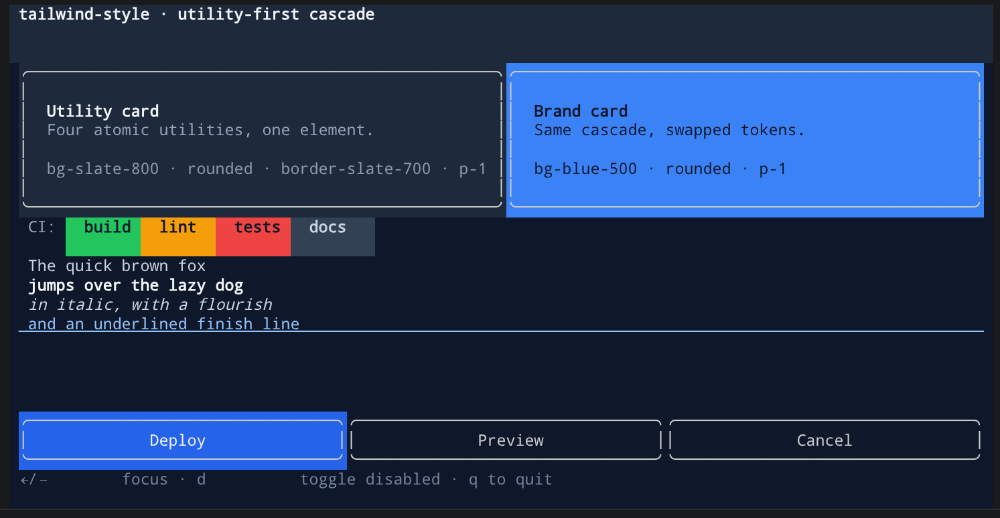
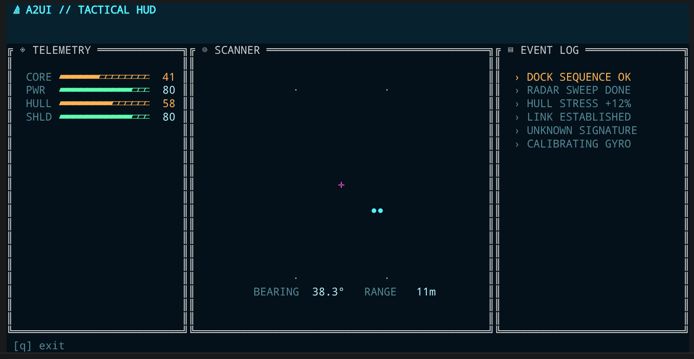

# ratatui-style

[](https://crates.io/crates/ratatui-style)
[](https://docs.rs/ratatui-style)
[](LICENSE)

**[English](README.en.md)**

一个面向 [ratatui](https://ratatui.rs) 的 CSS 级联引擎 —— 选择器、优先级、继承、伪状态、数据驱动样式。
输出原生 ratatui `Style` / `Block` / `Constraint`，不做并行渲染。

使用标准 CSS 属性名（`color`、`background-color`、`font-weight`、`border`、`padding`、`margin`、`text-align`、`width` …），
支持 `serde`（服务端驱动的 UI 可通过 JSON 传输样式），实现级联规则：
**来源层 × 优先级 × 继承 × 伪状态**。

## 截图展示

| [06_tailwind](examples/06_tailwind.rs) · 工具类设计系统 | [07_scifi_hud](examples/07_scifi_hud.rs) · 赛博朋克 HUD |
|:---:|:---:|
|  |  |

更多示例见下文 [示例](#示例) 一节。

## 快速开始

```rust
use ratatui_style::{CssStyle, Origin, OwnedNode, Stylesheet};

let mut sheet = Stylesheet::new();
sheet.add(
    "Button.primary",
    CssStyle::new().color("#fff").background("blue").bold(),
    Origin::User,
)?;

let node = OwnedNode::new("Button").with_classes(["primary"]);
let computed = sheet.compute(&node, None);

// 投影到原生 ratatui 类型：
let _style   = computed.to_style();         // → ratatui::style::Style
let _block   = computed.to_block();         // → ratatui::widgets::Block
let _area    = computed.apply_margin(area); // 缩小 Rect
let _layout  = computed.constraints();      // → (Constraint, Constraint)
let _align   = computed.alignment();        // → Alignment
```

### 盒模型 builder 的类型化输入

`.padding()` / `.margin()` / `.border()` 既能接受类型化值（零 panic），也能保留 CSS 简写字符串的便利：

```rust
use ratatui_style::{BorderStyle, CssStyle};

// 类型化 —— 不会 panic
CssStyle::new().padding(1u16);                       // 四边各 1
CssStyle::new().padding((0u16, 2u16));               // 上下 0、左右 2
CssStyle::new().padding((1u16, 2u16, 3u16, 4u16));   // 上右下左
CssStyle::new().border(BorderStyle::Rounded);
CssStyle::new().border((BorderStyle::Rounded, "#00d4ff"));

// 字符串简写仍可用（适合编译期已知的字面量，坏值会 panic）
CssStyle::new().padding("0 2").border("rounded #00d4ff");
```

## CSS 文本样式表

```rust
use ratatui_style::Stylesheet;

let sheet = Stylesheet::parse(r#"
    :root { --accent: #00d4ff; }

    Button.primary {
        color: var(--accent);
        background: blue;
        font-weight: bold;
        border: rounded;
        padding: 0 2;
    }
    Button:focus { background: green; }
    #save:disabled { color: gray; }
"#)?;
```

## 级联模型

级联按五个步骤为每个元素解析样式：

1. **收集** 所有选择器匹配该节点的规则。
2. **排序** 按 `(来源层, 优先级, 源码顺序)` 升序。
3. **叠加** 声明 —— 后出现的规则逐字段覆盖前面的。
4. **继承** —— 可继承属性（`color`、`font-weight`、`font-style`、`text-decoration`、`underline-color`、`text-align`）从父元素的计算样式流入子元素的 `None` 字段。
5. **解析** `var()` 引用，对照令牌表替换为具体值。

### 来源层

规则按来源分层；同等优先级下，高来源层覆盖低来源层：

| 来源 | 优先级 | 用途 |
|---|---|---|
| `UserAgent` | 最低 | 内置默认值 |
| `Theme` | | 应用级主题 |
| `User` | | 用户配置 / CSS 文本 |
| `Inline` | 最高 | 行内样式 |

### 优先级（Specificity）

`(id数, class数+伪类数, 类型数)` —— 标准 CSS 优先级，以元组形式比较。
`*`（通用选择器）为 `(0, 0, 0)`。

## 支持的 CSS 属性

| 属性 | 值类型 | 映射到 |
|---|---|---|
| `color` | [颜色](#颜色语法) | `Style::fg` |
| `background` / `background-color` | 颜色 | `Style::bg` / `Block::style` |
| `font-weight` | `bold` / `normal` / `100`–`900` | `Modifier::BOLD`（见下方说明） |
| `font-style` | `italic` / `normal` | `Modifier::ITALIC` |
| `text-decoration` | `underline` / `line-through` / 两者组合 | `Modifier::UNDERLINED` / `CROSSED_OUT` |
| `underline-color` | 颜色 | `Style::underline_color` |
| `border` | `none` / `single` / `rounded` / `double` / `thick` [颜色] | `Block::borders` + `border_type` |
| `border-top` / `border-right` / `border-bottom` / `border-left` / `border-x` / `border-y` | 同 `border` 简写（`<样式> [颜色]`），只作用于指定边 | `Block::borders`（按边组合） |
| `padding` | `1` / `1 2` / `1 2 3` / `1 2 3 4` | `Block::padding` |
| `margin` | 同 padding 简写 | `Rect` 缩小 |
| `text-align` | `left` / `center` / `right` | `Alignment` |
| `width` / `height` | `auto` / `10` / `50%` / `min(3)` / `max(5)` | `Constraint` |

### 边框：单边与组合

`border` 简写画出全部四条边。要只画某一条（或几条）边，用单边声明：

```css
.card { border-bottom: rounded #00d4ff; }   /* 只画底边 */
.tabs { border-bottom: single; }
```

支持的属性：

| 属性 | 作用的边 |
|---|---|
| `border-top` | 顶 |
| `border-right` | 右 |
| `border-bottom` | 底 |
| `border-left` | 左 |
| `border-x` | 左 + 右 |
| `border-y` | 顶 + 底 |

值格式与 `border` 一致：`<样式> [颜色]`，如 `border-bottom: rounded red`。

**组合语义**：单边声明在级联中以「按位 OR」累加，而非互相覆盖。所以两个原子类可以组合出顶 + 底：

```css
.bt { border-top: single; }
.bb { border-bottom: single; }
/* <div class="bt bb"> → 顶 + 底两条边 */
```

这与 Tailwind 式的 `.rounded`（设样式）+ `.border-slate-700`（设颜色）组合在同一元素上拼成一条完整边框是同一套机制。`border` 简写（全四边）的优先级更高：它声明的是「全部边」，与单边声明组合后仍是全部边（不会收窄）。

### `font-weight` 的限制

ratatui（以及终端本身）只支持单一的加粗修饰位（`Modifier::BOLD`），没有真正的字重（100–900）细分。因此：

- `font-weight: bold` / `bolder` / `700`–`900` → 加粗。
- `font-weight: normal` / `lighter` / `100`–`500` → 不加粗。
- `500` 与 `normal` 等价，`600` 与 `900` 等价。

这是终端字体能力的固有限制，不是解析器缺陷。

## 颜色语法

所有颜色属性支持：

| 语法 | 示例 |
|---|---|
| 十六进制 3/4/6/8 位 | `#fff` `#fff0` `#ff8800` `#ff8800ff` |
| `rgb()` / `rgba()` | `rgb(255, 128, 0)` `rgba(0,0,0,0.5)` |
| CSS 命名颜色 | `red` `blue` `cyan` `orange` `gold` … |
| `transparent` / `none` / `reset` | 重置为终端默认 |
| `inherit` | 强制从父元素继承 |
| `var(--name)` | CSS 自定义属性，可带回退值：`var(--accent, #fff)` |

## 选择器与伪类

复合选择器格式 `Type.class#id:pseudo…`，支持逗号列表和 `*` 通配：

```
Button                /* 类型 */
.primary              /* 类 */
#save                 /* id */
Button.primary:focus  /* 复合 */
Text, .muted, #title  /* 逗号列表 */
*                     /* 通配 */
```

伪类：`:focus` `:hover` `:disabled` `:checked` `:active`

## 继承与 `var()`

`color`、`font-weight`、`font-style`、`text-decoration`、`underline-color`、`text-align`
可从父元素的计算样式继承。`var(--name)` 从 `:root` 令牌表解析
（也可通过编程方式构建 `ThemeTokens`，或从 themekit 桥接）。

`var()` 当前支持**颜色**与**长度**（`width` / `height`）两类自定义属性：

```css
:root {
    --accent: #00d4ff;   /* 颜色 */
    --sidebar-w: 22;     /* 长度：等价于 22 个 cell */
    --half: 50%;         /* 长度：百分比 */
}
.side { width: var(--sidebar-w); }
.col  { width: var(--half); }
```

颜色与长度的字面量语法互不重叠（`#fff`/`rgb()`/命名色 vs `10`/`50%`/`auto`/`min(n)`），
因此 `:root` 会自动判定每个 `--name` 的类型。`var()` 引用可链式（`--w: var(--w2)`），
类型由链的终点决定；未定义或类型不符的 `var()` 在宽松解析时降级（颜色 → `Reset`，长度 → `Auto`），
在严格模式（[`Stylesheet::parse_strict`]）下报 `UndefinedVariable`。

> **暂不支持**：`padding` / `margin` / `border` 的 `var()` —— 这些属性的 `BoxEdges` / `BorderSpec`
> 表示尚无 `Var` 变体，改动较大，留待后续。
>
> **暂不支持**：`Block` 标题样式映射（`title-color` / `title-align`）。ratatui 的
> `Block::title_style` / `title_alignment` 已就绪，但本 crate 目前无法设置标题文本本身，
> 仅映射标题样式意义有限，留待后续与标题内容一起支持。

```rust
use ratatui_style::{CssStyle, Origin, OwnedNode, Stylesheet};

let mut sheet = Stylesheet::new();
sheet.tokens_mut().insert("accent", "#00d4ff");

sheet.add("Panel", CssStyle::new().color("#cdd6f4").italic(), Origin::Theme)?;
sheet.add("Button", CssStyle::new().background("var(--accent)").bold(), Origin::User)?;
sheet.add("Button:disabled", CssStyle::new().color("gray"), Origin::User)?;

// Panel 解析自身样式
let panel = sheet.compute(&OwnedNode::new("Panel"), None);

// Text 从 Panel 继承 color + italic
let text = sheet.compute(&OwnedNode::new("Text"), Some(&panel));

// 禁用按钮：:disabled 规则生效，color=gray
let btn = sheet.compute(
    &OwnedNode::new("Button").with_state(ratatui_style::State::disabled()),
    Some(&panel),
);
```

### 遍历组件树：`CascadeContext`

真实组件树里要给每个子节点手动传 `Some(&parent)` 既啰嗦又易错。`CascadeContext`
是一个级联遍历器：它持有一个 `Stylesheet` 引用 + 可复用 scratch + 一个 parent
计算样式栈。`enter(node)` 自动用栈顶（若有）作为 parent 计算节点样式、压栈并返回
owned 副本；`leave()` 弹栈。这样遍历组件树时完全无需手写 parent 穿线。

```rust
use ratatui_style::{CascadeContext, OwnedNode, Stylesheet};

let sheet: Stylesheet = /* … */;
let mut ctx = CascadeContext::new(&sheet);

// Root
let root = ctx.enter(&OwnedNode::new("Root"));
// …渲染 root…

// Panel（Root 的子节点）
let panel = ctx.enter(&OwnedNode::new("Panel"));
// …渲染 panel…

// Text（Panel 的子节点）—— 自动继承 Panel 的 color
let text = ctx.enter(&OwnedNode::new("Text"));
// …渲染 text…
ctx.leave(); // 回到 Panel 上下文

ctx.leave(); // 回到 Root 上下文
ctx.leave(); // 完成
```

> `enter` 返回 owned 副本，调用者无需操心借用顺序（避免返回 `&self` 借用
> 导致无法嵌套 `enter` 的问题）。压栈时的一次 `clone` 也极廉价：解析后的
> `ComputedStyle` 只含 `Literal`/`Reset` 字段（`var()` 已解析），无 `String`/
> `Box`/`Vec` 堆字段，是纯栈上 memcpy。

## 严格模式与带位置的错误

默认的 [`Stylesheet::parse`] 是**宽松**的：未知属性被静默忽略（向前兼容），
未定义的 `var()` 在级联时降级为 `Reset`。这对生产渲染很稳健，但对"手写 CSS"
的诊断体验不佳——拼写错误悄悄消失。

为此提供两个改进：

### 1. 解析错误带行:列

所有由解析产生的 [`CssError`] 现在携带一个 1-based 的 [`Loc { line, column }`]。
注释剥离被改为**位置保持**（把注释字符替换为空格、但保留其中的 `\n`），所以
清洗后的文本与原输入等长，字节偏移可直接映射回原文行:列。

```rust
use ratatui_style::Stylesheet;

let css = "Button {\n    color: red;\n    background: #zzz;\n}\n";
let err = Stylesheet::parse(css).unwrap_err();
let loc = err.loc.unwrap();
assert_eq!(loc.line, 3); // 指向写错的 #zzz 那一行
```

### 2. `parse_strict` 严格解析

[`Stylesheet::parse_strict`] 在 [`parse`] 的基础上把两种情况升级为硬错误：

- **未知属性**：不在已知属性集里、且不是 `--` 前缀自定义属性的声明。错误类型为
  `CssErrorKind::UnknownProperty`，loc 精确指向该属性名。
- **未定义变量**：没有 fallback 的 `var(--name)`，且 `name` 不在本样式表的令牌表
  中。错误类型为 `CssErrorKind::UndefinedVariable`（loc 目前为 `None`，见下文注记）。
  带 fallback 的 `var(--nope, #fff)` 不会报错。

```rust
use ratatui_style::{Stylesheet, CssErrorKind};

// 拼写错误：colr → UnknownProperty，loc 指向第 1 行
let err = Stylesheet::parse_strict("Foo { colr: red; }").unwrap_err();
assert!(matches!(err.kind, CssErrorKind::UnknownProperty(ref p) if p == "colr"));

// 未定义变量 → UndefinedVariable
let err = Stylesheet::parse_strict("Foo { color: var(--nope); }").unwrap_err();
assert!(matches!(err.kind, CssErrorKind::UndefinedVariable(_)));

// 先声明再引用 → 正常
Stylesheet::parse_strict(":root{--x:red;}\nFoo{color:var(--x);}").unwrap();
// 带 fallback → 正常
Stylesheet::parse_strict("Foo { color: var(--nope, #fff); }").unwrap();
```

> **注记**：未定义变量错误目前不带精确 `loc`（为 `None`）。属性错误的 loc 是精确的。
> 这是有意取舍：属性名在解析阶段即可定位，而 `var()` 出现的位置需要额外的解析期
> 记录才能回溯，成本较高，故先以不带 loc 的形式报出 kind。

[`Stylesheet::parse`]: https://docs.rs/ratatui-style/latest/ratatui_style/stylesheet/struct.Stylesheet.html#method.parse
[`Stylesheet::parse_strict`]: https://docs.rs/ratatui-style/latest/ratatui_style/stylesheet/struct.Stylesheet.html#method.parse_strict
[`parse`]: https://docs.rs/ratatui-style/latest/ratatui_style/stylesheet/struct.Stylesheet.html#method.parse
[`CssError`]: https://docs.rs/ratatui-style/latest/ratatui_style/struct.CssError.html
[`Loc { line, column }`]: https://docs.rs/ratatui-style/latest/ratatui_style/struct.Loc.html

## 框架集成

在你的节点类型上实现 `StyledNode` —— 引擎不依赖任何特定框架：

```rust
use ratatui_style::{Classes, StyledNode, State, Position};

impl StyledNode for MyNode {
    fn type_name(&self) -> &str { &self.kind }
    fn id(&self) -> Option<&str> { self.id.as_deref() }
    // classes() 现在返回零分配视图 Classes<'_>，而非 Vec<&str>。
    fn classes(&self) -> Classes<'_> {
        Classes::from_vec(self.classes.iter().map(String::as_str).collect())
    }
    fn state(&self) -> State { self.state }
    fn position(&self) -> Position { self.position.clone() }
}
```

### 每帧零分配的热路径

draw 循环里反复调用 `compute` 会成为分配热点。用借用的 [`NodeRef`]（构造零分配）
+ 复用的 [`ComputeScratch`]（匹配缓冲跨帧复用）来消除每帧分配：

```rust
use ratatui_style::{NodeRef, ComputeScratch};

// 在 draw 之外（或 main 中）持有一个 scratch，跨帧复用容量：
let mut scratch = ComputeScratch::new();

// draw 循环内：NodeRef 全是 &'static str 借用，零 String/Vec 分配。
let node = NodeRef::new("Button").classes(&["primary"]).state(State::focus());
let computed = sheet.compute_with(&node, None, &mut scratch);
```

`OwnedNode` 仍保留作为便利的拥有型节点（测试、一次性查询）；它的 `classes()` 仍会
产生一次 `Vec` 分配，但热点路径已迁到 `NodeRef`。

### 运行时主题与文件热重载

主题不一定来自编译期 `css!` 宏。`RuntimeStyle` 支持两种构造基表（base stylesheet）：

- **静态基表**（`RuntimeStyle::new(&'static Stylesheet)`）：`css!` 宏工作流，零成本。
- **拥有型基表**（`RuntimeStyle::from_owned(Arc<Stylesheet>)`）：从磁盘/配置/网络在运行时
  解析的主题，无需 `Box::leak`：

```rust
use std::sync::Arc;
use ratatui_style::{RuntimeStyle, Stylesheet};

let css = std::fs::read_to_string("theme.css")?;
let style = RuntimeStyle::from_owned(Arc::new(Stylesheet::parse(&css)?));
```

加载后可用 `load_override(&path)` 一次性叠加用户层 CSS（`Origin::User` 覆盖 `Origin::Theme`）。
更实用的是基于 mtime 的轻量热重载 —— 在 app 的 tick 里调用，文件没改就不重解析：

```rust
// 在事件循环的 tick / poll 里：
if style.reload_if_changed(path.as_ref())? {
    // 主题文件变了 —— 已重新解析合并，下一次 compute() 即生效
}
```

`reload_if_changed` 只在文件 mtime 变化时返回 `true`；文件被删除视为"移除 override"
（与 `load_override` 的 `NotFound` 语义一致）。文件系统无法提供 mtime 时降级为"每次都重载"，
确保不会静默丢失更新。

## Feature 标志

| Feature | 默认 | 说明 |
|---|---|---|
| `serde` | ✅ | 为所有值类型提供 `Serialize`/`Deserialize` —— JSON 属性映射、配置文件、传输格式 |
| `themekit` | ❌ | `ThemeTokens::from_themekit` —— 将 `ratatui-themekit` 语义颜色槽桥接为 CSS `var()` 令牌 |

禁用默认 feature 可获得零依赖的纯样式引擎：

```toml
[dependencies]
ratatui-style = { version = "0.1", default-features = false }
```

## 示例

```sh
# 交互式仪表盘 —— 纯 CSS 驱动，单一样式表
cargo run --example 05_dashboard

# 级联演示 —— 继承、var()、优先级、伪状态
cargo run --example 03_cascade

# CSS 文本样式表解析
cargo run --example 02_stylesheet

# 颜色与值解析
cargo run --example 01_values

# css! 宏：编译期嵌入 + 运行时覆盖
cargo run --example 09_runtime_override

# scss! 宏：编译期嵌入 SCSS（需要 scss feature）
cargo run --example 10_scss_embed --features scss

# themekit 桥接（需要 themekit feature）
cargo run --example 11_themekit_bridge --features themekit
```

## 生态定位

| Crate | 定位 | `ratatui-style` |
|---|---|---|
| `ratatui-themekit` | 15 个语义颜色槽 + 调色板 | **组合使用** —— `ThemeTokens::from_themekit` 填充 CSS 变量 |
| `tui-theme-builder` | 编译期 `Style` 宏 | `ratatui-style` 覆盖 **运行时/配置驱动** 场景 |
| `lipgloss` | "终端 CSS"（自有渲染栈） | 同类 DX，基于 ratatui 的 buffer 模型 |

## 当前状态

已实现：CSS 文本解析器、复合选择器、优先级、级联层（`UserAgent` < `Theme` < `User` < `Inline`）、
伪状态、`var()`（含回退值）、继承、盒模型（`padding` / `margin` / `border`）、
尺寸（`width` / `height` → `Constraint`）、`serde` 集成、`themekit` 桥接。

计划中：后代/子代组合器（`A B`、`A > B`）、`:nth-child`、`@media`、`ComputedStyle` 缓存。

## 许可证

MIT
